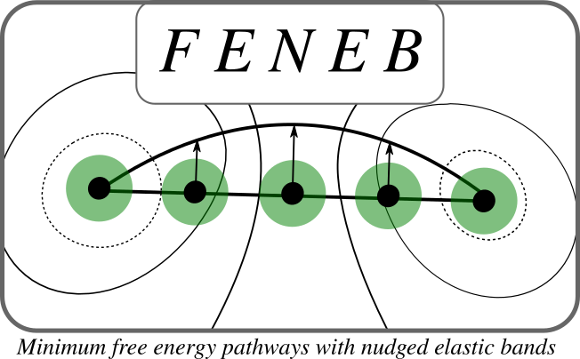
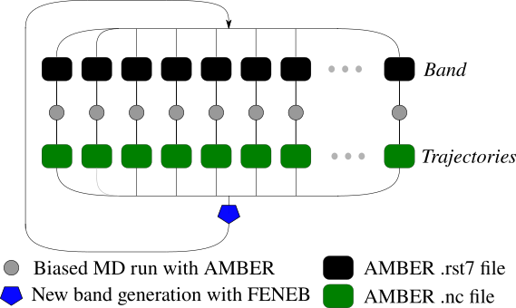

# FENEB
A tool for performing nudged elastic bands simulations on the free energy surface using Amber .nc files.

# How it works
You run the MD with AMBER, feed this code with .rst7 and .nc files, and you will get new .rst7 files to continue the optimization. Additionally, every time this code is executed, an output file will be genereated whith thermodynamic information (free energy gradients, free energy differences).

# Requirements
NETCDF Libraries.

# Compilation 
Execute ./compile.sh

# References 
- Semelak, et. al. (2022). Minimum free energy pathways with the nudged elastic band method in combination with a QM-MM Hamiltonian. ChemRxiv. Cambridge: Cambridge Open Engage. This content is a preprint and has not been peer-reviewed.
- Bohner, et. al. (2014). Nudged-elastic band used to find reaction coordinates based on the free energy. The Journal of Chemical Physics, 140(7), 074109.
