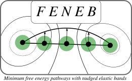

# feneb
A tool for performing nudged elastic bands simulations on the free energy surface using Amber .nc files.

Briefly:

- INPUTSPREP folder: Contains scripts to extract the data of interest from NAMD outpus run with AMBER-LIO (https://github.com/MALBECC/lio).
- correlation.py: Performs the PCA-like analysis using the files generated by the previous scripts as inputs.

